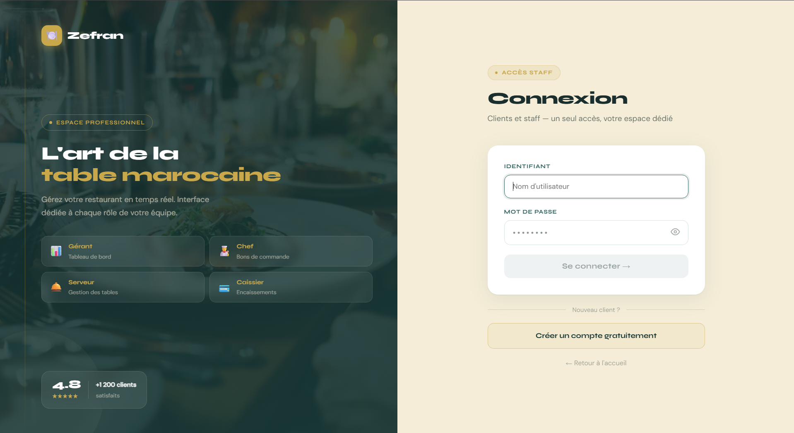
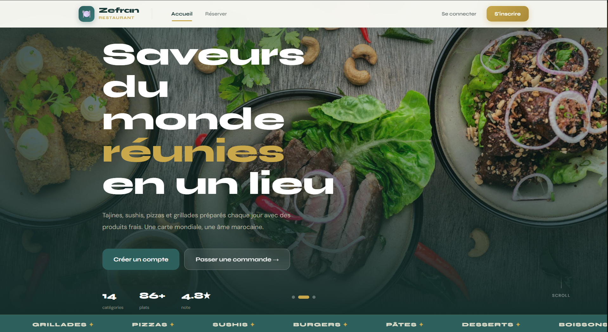
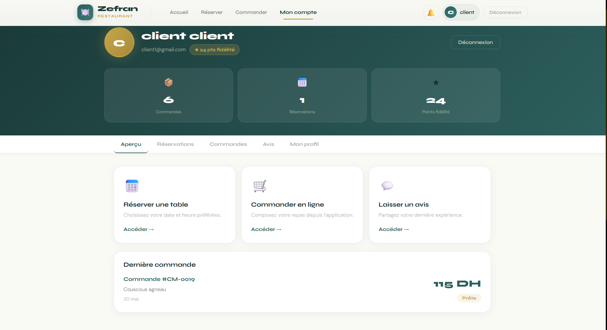
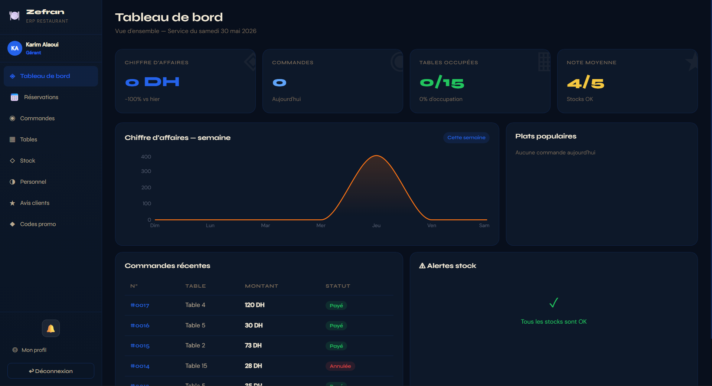
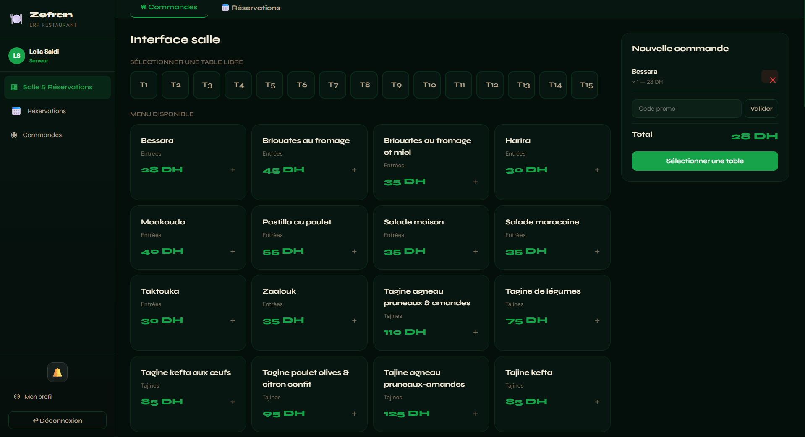
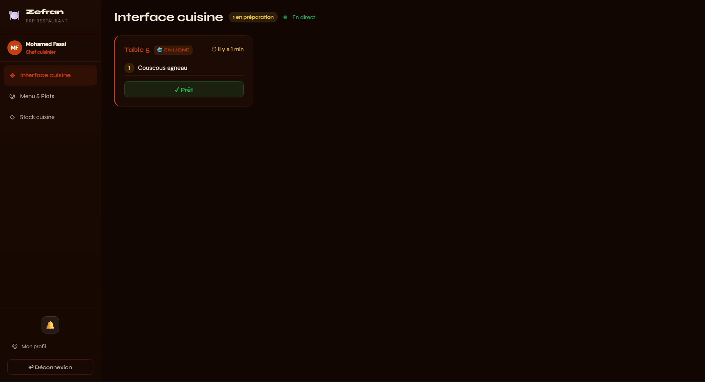
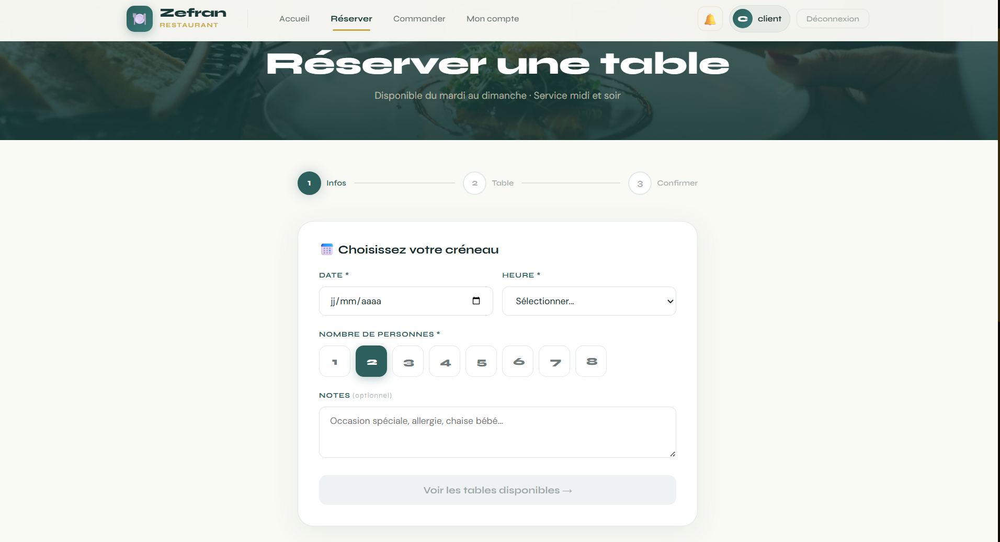
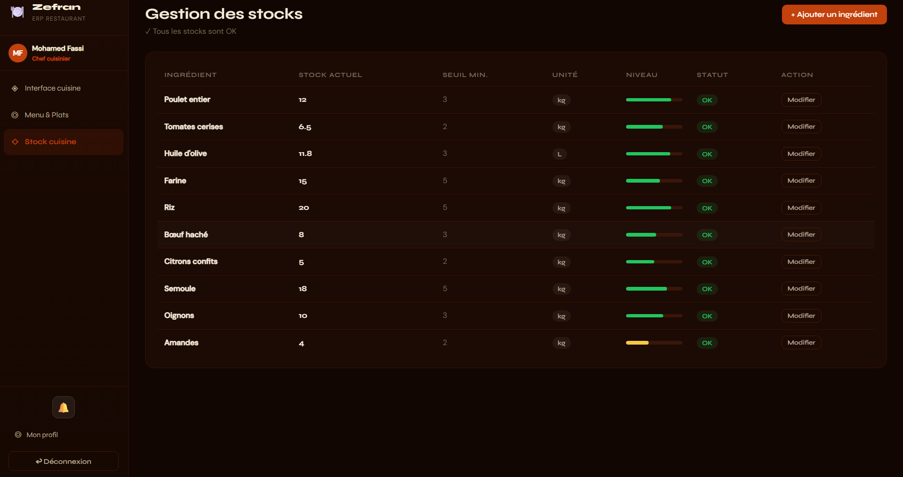
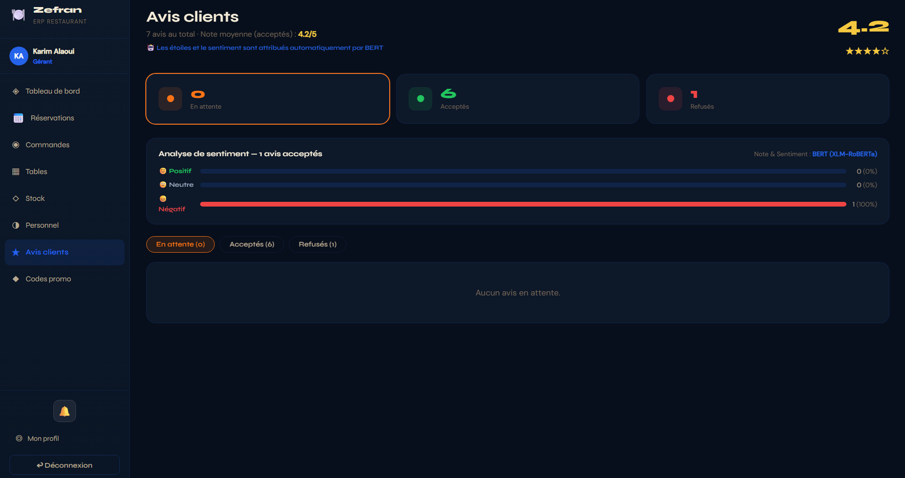

<<<<<<< HEAD
# 🍽️ Zefran — Restaurant Management System

> A full-stack restaurant management system designed to centralize and simplify restaurant operations.

Zefran is a web-based application developed as part of a final-year Computer Engineering project at **EMSI**.

The platform provides dedicated interfaces for restaurant staff and customers, allowing the management of daily operations such as orders, reservations, menu items, stock, tables and restaurant activities.

---

## ✨ Overview

Zefran is built around two main interfaces:

- 🧑‍💼 **Staff Interface** — Management and operational dashboard
- 🛒 **Client Interface** — Customer-facing interface for browsing, ordering and reservations

The system uses a modern **frontend/backend architecture**, with a React frontend communicating with a Django REST API.

---

## 🚀 Features

### 🧑‍💼 Staff Management

The system provides role-based interfaces for:

- 👨‍💼 Manager
- 👨‍🍳 Chef
- 🧑‍🍳 Waiter
- 💳 Cashier

Each role can access the functionalities relevant to their responsibilities.

### 📋 Restaurant Management

- 📋 Order management
- 🍔 Menu management
- 📦 Stock management
- 🪑 Table management
- 📅 Reservation management
- ⭐ Customer reviews
- 📊 Dashboard and statistics
- 👥 Staff management
- 🔐 Authentication and authorization

### 🛒 Client Features

Customers can:

- Browse the restaurant
- View the menu
- Place orders
- Make reservations
- Submit reviews
- Interact with the restaurant's online interface

---

## 🖼️ Screenshots

### 🔐 Login



### 🏠 Home



### 👤 Client Interface



### 📊 Dashboard



### 🛒 Orders



### 👨‍🍳 Kitchen



### 📅 Reservations



### 📦 Stock Management



### ⭐ Reviews



---

## 🏗️ Architecture

The application follows a separated **frontend/backend architecture**.

```text
                    ┌─────────────────────┐
                    │      React App      │
                    │      + Vite         │
                    └──────────┬──────────┘
                               │
                         HTTP / Axios
                               │
                               ▼
                    ┌─────────────────────┐
                    │    Django REST API  │
                    │   Django REST       │
                    │   Framework         │
                    └──────────┬──────────┘
                               │
                               ▼
                    ┌─────────────────────┐
                    │       SQLite        │
                    │      Database       │
                    └─────────────────────┘
=======
<<<<<<< HEAD
MangerManger — Restaurant Management System

> A full-stack restaurant management ERP developed as a final-year project in Computer Engineering at EMSI.

MangerManger is a web-based restaurant management system designed to centralize and simplify daily restaurant operations.

The application is divided into two main interfaces:

- 🧑‍💼 **Staff Interface** — Management dashboard for restaurant staff
- 🛒 **Client Interface** — Customer-facing application for online orders and reservations

---

## 🚀 Features

### 🧑‍💼 Staff Management

The staff interface provides dedicated functionalities for:

- 👨‍💼 Manager
- 👨‍🍳 Chef
- 🧑‍🍳 Waiter
- 💳 Cashier

Depending on the user's role, different features and operations are available.

### 📦 Restaurant Operations

- 📋 Order management
- 🍔 Menu management
- 📦 Stock management
- 🪑 Table management
- 📅 Reservation management
- 💰 Billing and payment management
- 📊 Statistics and dashboards

### 🛒 Client Interface

Customers can access a dedicated interface to:

- Browse the restaurant menu
- Place online orders
- Make reservations
- Interact with the restaurant's online storefront

### 🔐 Authentication

The backend uses token-based authentication through Django REST Framework.

---

## 🏗️ Project Architecture

The project follows a separated frontend/backend architecture:

```text
restaurant-management-system/
│
├── mangermanger/              # Django Backend
│   ├── manage.py
│   ├── ...
│   └── ...
│
├── mangermanger-front/        # React Frontend
│   ├── src/
│   ├── public/
│   ├── package.json
│   └── ...
│
├── .gitignore
└── README.md
```

### Backend

The backend is responsible for:

- REST API
- Authentication
- Business logic
- Database management
- Data processing

### Frontend

The frontend communicates with the Django REST API and provides the user interfaces for staff and customers.

---

## 🛠️ Technologies

### Backend

- 🐍 Python
- Django 4.x
- Django REST Framework
- SQLite
- django-cors-headers
- Token Authentication

### Frontend

- ⚛️ React 19
- Vite
- Axios
- React Router DOM
- Recharts

---

## ⚙️ Installation

### 1. Clone the repository

```bash
git clone https://github.com/Anas-Laarej/restaurant-management-system.git

cd restaurant-management-system
```

---

## 🐍 Backend Setup

Navigate to the backend:

```bash
cd mangermanger
```

Create a virtual environment:

```bash
python -m venv .venv
```

### Windows

```bash
.venv\Scripts\activate
```

### Linux / macOS

```bash
source .venv/bin/activate
```

Install the dependencies:

```bash
pip install django djangorestframework django-cors-headers
```

Run database migrations:

```bash
python manage.py migrate
```

Optional: populate the database with test data:

```bash
python seed_data.py
```

Start the Django development server:

```bash
python manage.py runserver
```

Backend:

```text
http://localhost:8000
```

---

## ⚛️ Frontend Setup

Open another terminal and navigate to:

```bash
cd mangermanger-front
```

Install dependencies:

```bash
npm install
```

Start the development server:

```bash
npm run dev
```

Frontend:

```text
http://localhost:5173
```

---

## 🔗 Frontend ↔ Backend

The React frontend communicates with the Django backend through REST API endpoints.

```text
React + Vite
     │
     │ Axios / HTTP Requests
     ▼
Django REST Framework
     │
     ▼
   SQLite
```

---

## 📊 Dashboard

The staff interface includes dashboards and statistical visualizations to help restaurant staff monitor operations and activity.

Charts are implemented using **Recharts**.

---

## 👥 Team

Developed by:

- **Anas Laarej**
- **Anass Nazih**

As part of a final-year Computer Engineering project at **EMSI**.

---

## 🎓 Academic Project

This project was developed as part of an academic project in **Computer Engineering at EMSI**.

---

## 📄 License

This project is an academic project developed for educational purposes.

---

## ⭐ Project

If you find this project interesting, feel free to explore the repository and follow the development.

**GitHub:**
https://github.com/Anas-Laarej/restaurant-management-system
>>>>>>> 3d98885 (chore: add backend requirements)
